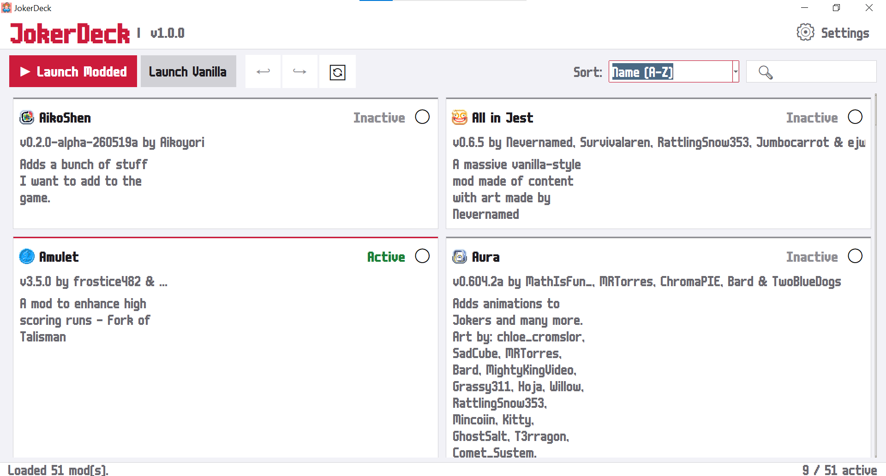
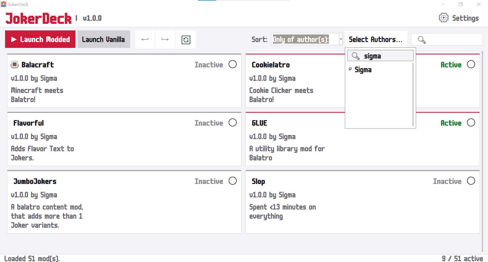
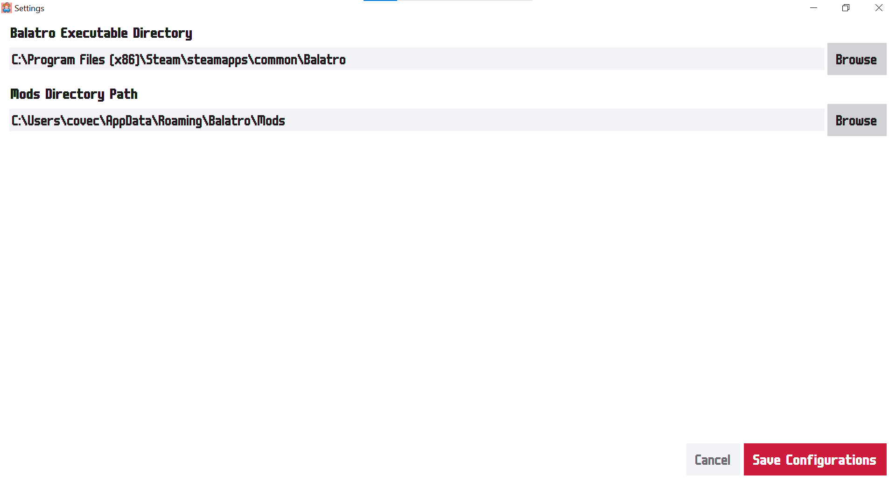
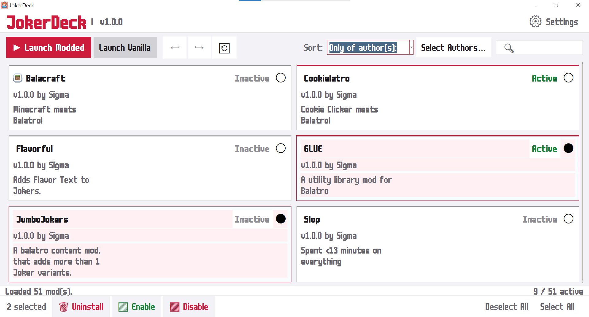

### a balatro mod manager that doesn't suck

tired of digging through your `AppData` folder like a raccoon every time you want to swap mods? yeah. me too. 
JokerDeck is a simple, clean mod manager for Balatro. (Reads your local mods, and allows you to download mods from an all-new JokerDeck index)

---

## current features

- **a great (probably) mod browser**
- **enable/disable mods with a click**
- **bulk select (gotta love efficiency)**
- **undo/redo**
- **mod icons, locally and on the mod browser**
- **launch modded or vanilla**
- **auto-detects mod info**

---

## getting started

### requirements
before anything, you need:
- **Balatro** (Xbox Game Pass version is **not** supported, sorry)
- **Lovely Injector** — [download here](https://github.com/ethangreen-dev/lovely-injector/releases/tag/v0.9.0)
- **Steamodded** — [download here](https://github.com/Steamodded/smods/releases/tag/1.0.0-beta-1620a)

set those up first, then grab JokerDeck.

### installation
1. download the latest `.exe` from [Releases](../../releases)
2. drop it anywhere you want
3. run it, go to Settings (top right) and point it in the right direction
4. you're done!

---

## running from source

if you want to run the `.pyw` directly instead of the exe, you'll need:
- Python 3.1*+
- Pillow (run `pip install pillow` after Python in a console) - for mod icons, optional but recommended

then just run `JokerDeck.pyw` and you're good.

---

## notes

- mods are managed via Lovely Injector's `.lovelyignore` system - disabling a mod just drops a file in its folder, nothing gets deleted
- uninstalled mods get moved to a `Uninstalled` folder, not permanently deleted
- config is saved locally, so nothing weird going on

---

---

made with ❤ and way too much free time
